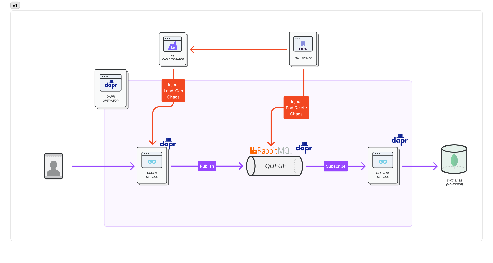
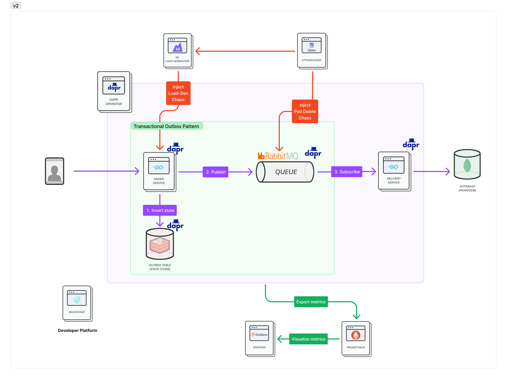
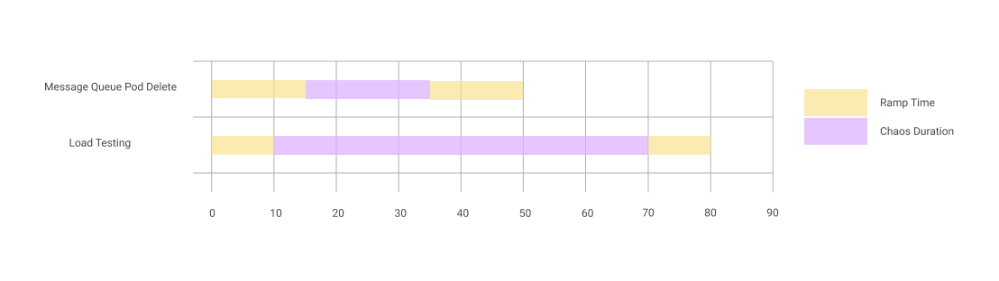

# KubeCon China 2024 Chaos Engineering

## Introduction
- Session Info: [Here](https://sched.co/1eYaZ)
- Recording: [Here](https://youtu.be/3mjGEh905u4?feature=shared)
- Slide: [Here](./resources/kubecon_china_What_if_Your_System_Experiences_an_Outage_v1.pdf)

## Tooling used
- [LitmusChaos](https://litmuschaos.io/)
- [Dapr](https://dapr.io/)
- [Prometheus](https://prometheus.io/)
- [Grafana](https://grafana.com/)
- [RabbitMQ](https://www.rabbitmq.com/)
- [MongoDB](https://www.mongodb.com/)
- [Redis](https://redis.io/)
- [k6](https://k6.io/)
- [Kubernetes](https://kubernetes.io/)

## Architecture

### V1

### V2


### Chaos Engineering Info



## Setup

### Pre-requisite

```shell
## start minikube
minikube start --memory 8192 --cpus 4 

## init dapr in k8s
dapr init --kubernetes --wait -n default

## install rabbitmq operator for pubsub
helm install rb bitnami/rabbitmq-cluster-operator -n default

## install prometheus using helm
helm repo add prometheus-community https://prometheus-community.github.io/helm-charts
helm install dapr-prom prometheus-community/prometheus --values ./common/prometheus-values.yaml -n default

## install Grafana
#### username: admin, password: admin
#### import dashboard: ./common/grafana-*.json
helm repo add grafana https://grafana.github.io/helm-charts
kubectl --namespace default create secret generic grafana-password \
   --from-literal=admin-user=admin --from-literal=admin-password=admin
helm install grafana grafana/grafana --values ./common/grafana-values.yaml --namespace default
```

### LitmusChaos

```shell
## install mongo
helm repo add bitnami https://charts.bitnami.com/bitnami
helm install my-release bitnami/mongodb --values ./litmus/mongodb-values.yaml -n litmus --create-namespace --version 12.1.31

## install litmus v3.8.0
kubectl apply -f https://raw.githubusercontent.com/litmuschaos/litmus/master/mkdocs/docs/3.8.0/litmus-cluster-scope-3.8.0.yaml

kubectl create secret generic k6-script-v1 \
    --from-file=./litmus/script-v1.js -n litmus
    
kubectl create secret generic k6-script-v2 \
    --from-file=./litmus/script-v2.js -n litmus
    
# Probe for v1
# - name: v1-assert-rabbitmq-is-running
## - type: httpProbe
## - conf: url(http://pubsub.v1.svc.cluster.local:15672), method(GET), criteria(statusCode == 200)
# - name: v1-assert-isDelivered-true
## - type: cmdProbe
## - conf: command(curl -s "http://delivery-app-v1.v1.svc.cluster.local:6005/result"), criteria(int, is 0)

# Probe for v2
# - name: v2-assert-rabbitmq-is-running
## - type: httpProbe
## - conf: url(http://pubsub.v2.svc.cluster.local:15672), method(GET), criteria(statusCode == 200)
# - name: v2-assert-isDelivered-true
## - type: cmdProbe
## - conf: command(curl -s "http://delivery-app-v2.v2.svc.cluster.local:6005/result"), criteria(int, is 0)

# you can create chaos experiments directly using manifest files in the litmus/manifest directory
```

### V1
```shell
kubectl create namespace v1
kubectl apply -f ./v1/deploy/rabbitmq.yaml
kubectl apply -f ./v1/deploy/pubsub.yaml
kubectl apply -f ./v1/deploy/delivery.yaml
kubectl apply -f ./v1/deploy/order.yaml
```

### V2

```shell
## init dapr in k8s
kubectl create namespace v2

## init redis for pubsub
## https://docs.dapr.io/getting-started/tutorials/configure-state-pubsub/#step-1-create-a-redis-store
helm repo add bitnami https://charts.bitnami.com/bitnami
helm repo update
helm install redis bitnami/redis --set image.tag=6.2 --set architecture=standalone -n v2
kubectl apply -f ./v2/deploy/redis-state.yaml

## install rabbitmq for pubsub
kubectl apply -f ./v2/deploy/rabbitmq.yaml
kubectl apply -f ./v2/deploy/pubsub.yaml

## install applications
kubectl apply -f ./v2/deploy/delivery.yaml
kubectl apply -f ./v2/deploy/order.yaml
```

### backstage

```shell
cd backstage
# litmus setup: https://github.com/litmuschaos/backstage-plugin
# grafana setup: https://github.com/K-Phoen/backstage-plugin-grafana/blob/main/docs/setup.md
yarn dev
```

# Reference
- [Dapr - hello-kubernetes](https://github.com/dapr/quickstarts/tree/master/tutorials/hello-kubernetes)
- [Dapr - how to use outbox](https://docs.dapr.io/developing-applications/building-blocks/state-management/howto-outbox/)
- [Dapr - rabbitmq](https://docs.dapr.io/reference/components-reference/supported-pubsub/setup-rabbitmq/)
- [Dapr - Prometheus Setup](https://docs.dapr.io/operations/observability/metrics/prometheus/)
- [RabbitMQ's persistence](https://www.rabbitmq.com/kubernetes/operator/using-operator#persistence)
- [RabbitMQ HA mode](https://www.infracloud.io/blogs/setup-rabbitmq-ha-mode-kubernetes-operator/)
- [MongoDB cli auth](https://medium.com/@yasiru.13/mongodb-setting-up-an-admin-and-login-as-admin-856ea6856faf)
- [RabbitMQ Prometheus Setup](https://www.rabbitmq.com/kubernetes/operator/operator-monitoring)
- [RabbitMQ Dashboard](https://grafana.com/grafana/dashboards/10991-rabbitmq-overview/)
